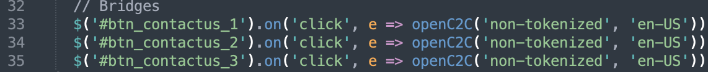
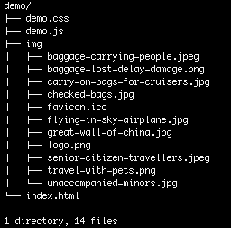
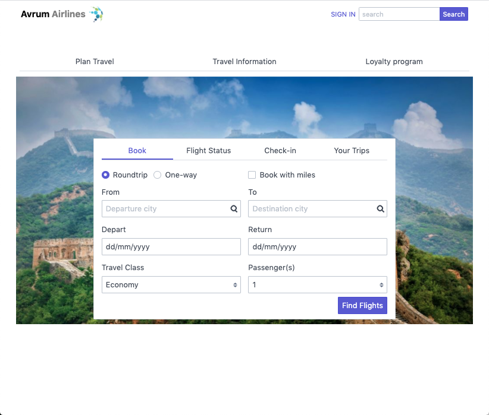
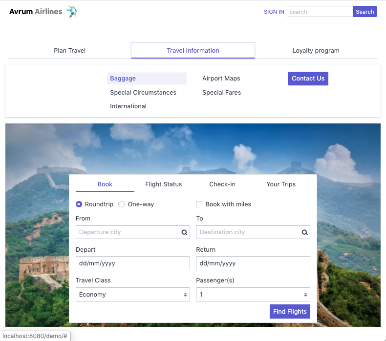
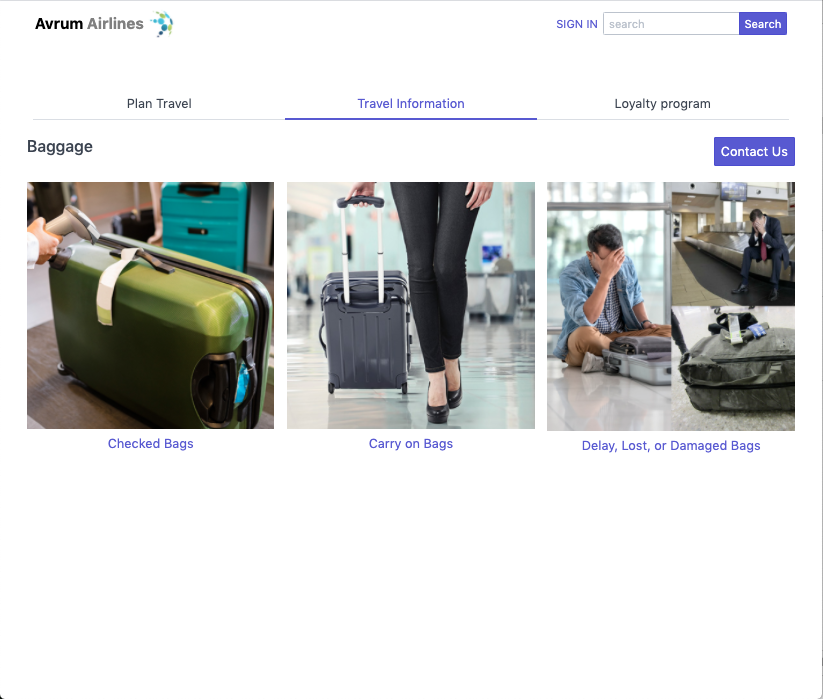
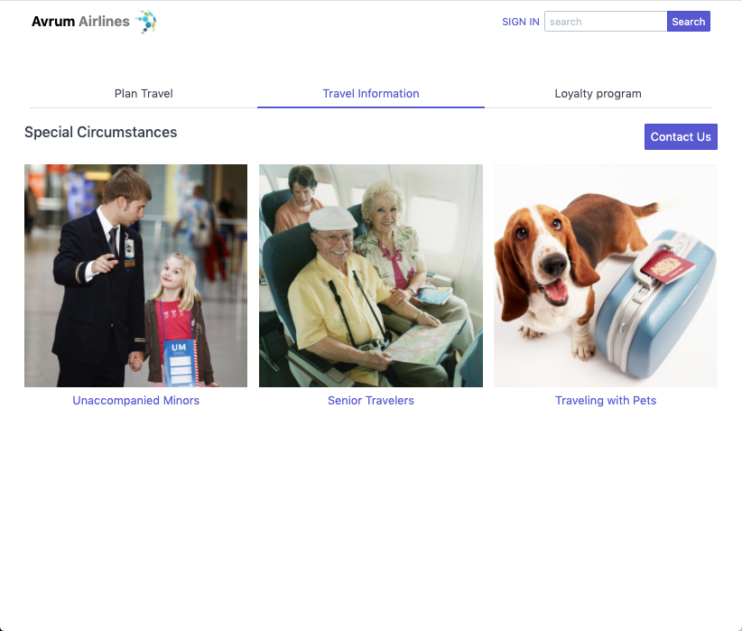

# avrum-airlines-demo

This app is used to demo the **CpaasC2C Reference App** just like in a real life scenario.

## Deploy

The demo app is independent of **CpaasC2C Reference App** , so the content of this app can be hosted either at root or at any path on server.

> Note that the folder name **demo** is not bound to app, so it can be replaced by any other relevant name if you are hosting it on path other than root on server.

## Usage

When you load the demo app, you'll see the demo pages where you can go to the **Travel information** tab and either click on **Contact us** button to open _Webpage C2C Reference App_ or click on **Baggage** or **Special Circumstances** item to move on to next page and there also you can click on **Contact us** button.

# User Guide

- [User Guide](#user-guide)
    - [Prepare](#prepare)
    - [Deploy](#deploy)
    - [Usage](#usage)

## Prepare
- Make sure **CpaasC2C Reference App** is running.
- Now go to the **demo/** folder.

Open **demo.js** file in editor.

- At line #1, you need to configure the actual URL of **CpaasC2C Reference App** (below is the localhost url you can replace with actual URL of Cpaas C2C Reference Ap).
'http://localhost:8080/'

- Actually this URL refers to **CpaasC2C Reference App.** So you should put complete URL to access the deployed **CpaasC2C Reference App.**.

e.g., **https://c2c.domain.com/v1/** where *v1* may refers to version 1.0 of the app but any other path will also work here.

 - At line **33** onward, find 3 lines of code for each **Contact us**  button (as shown in below image).
     

## Deploy

The demo app folder structure is given below image.

- As the demo app is independent of **CpaasC2C Reference App.**, so the content of this app can be hosted either at root or at any path on server.

- Note that the folder name **demo** is not bound to app, so it can be replaced by any other relevant name if you are hosting it on path other than root on server.

For example, all these combinations of hierarchies will work in the same way

1.  Suppose the website is [http://www.domain.com/](http://c2c.domain.com/) 
    1.  C2C is accessible at [http://www.domain.com/c2c](http://www.domain.com/c2c) 
    2.  Demo is accessible at [http://www.domain.com/demo](http://www.domain.com/demo)
2.  Suppose the website is [http://demo.domain.com/](http://demo.domain.com/) where Demo is accessible
    1.  C2C is accessible at [http://demo.domain.com/c2c](http://demo.domain.com/c2c) 
3.  Suppose the website is [http://c2c.domain.com/](http://c2c.domain.com/) where C2C is accessible
    1.  Demo is accessible at [http://c2c.domain.com/demo](http://c2c.domain.com/demo) 

## Usage

When you load the demo app, you'll see this screen (as shown in below image).

- Now go to the **Travel information** tab where you can either click on **Contact us** button to open **CpaasC2C Reference App.** otherwise click on **Baggage** or **Special Circumstances** item to move on to next page(as shown in below image).
     

- On click of **Travel information > Baggage** item, the _**Baggage**_ page will open like this where you can click on the **Contact us** button to open **CpaasC2C Reference App**(as shown in below image).
    

- On click of **Travel information > Special Circumstances** item, then _**Special Circumstances**_ page will open like this where you can click on the **Contact us** button to open **CpaasC2C Reference App** (as shown in below image).
    